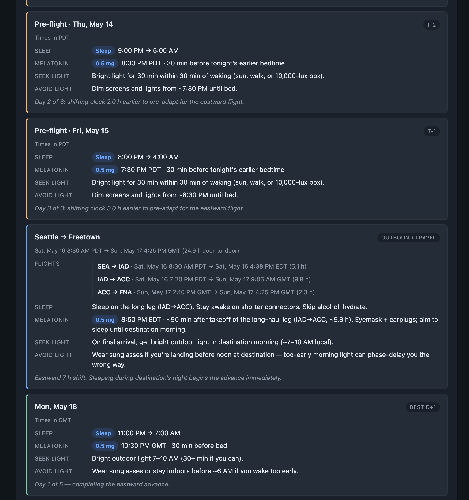

# Jet Lag Plan

A single-file web app that turns your flight itinerary into a day-by-day melatonin and light-exposure schedule for beating jet lag. No server, no login, no data sent anywhere — just open `index.html` in a browser.



## Features

- **Paste any itinerary** — understands Flighty, Google Flights, airline confirmation emails, or plain text
- **Multi-leg trips** — handles connecting flights and layovers; auto-detects your actual destination by longest stay
- **Science-based dosing** — implements the Eastman & Burgess circadian-shifting protocol (0.5 mg melatonin timed to phase-advance or phase-delay your clock)
- **Light schedule** — tells you when to seek bright light and when to avoid it, because light is a stronger zeitgeber than melatonin and poorly-timed light undoes the shift
- **Long-haul east/west logic** — shifts > 12 h are correctly treated as the shorter-direction adjustment (e.g. a 14 h eastward hop is planned as a 10 h westward delay)
- **250+ airports** — major hubs across all continents with correct IANA timezones and DST handling
- **No dependencies** — vanilla HTML/CSS/JS, one file, works offline

## Usage

1. Open `index.html` in any modern browser (Chrome, Safari, Firefox, Edge).
2. Paste your itinerary into the text area and click **Parse paste**.
3. Verify the detected flight legs (edit any that look wrong).
4. Set your usual home bedtime/wake time and preferred dose.
5. Click **Generate schedule** for a day-by-day plan from pre-flight prep through post-return recovery.

### Supported paste formats

**Flighty-style (↗/↘ markers):**
```
United 996 on May 16, 2026
↗ 7:20 PM EDT IAD
↘ 9:05 AM GMT ACC
```

**Plain text:**
```
JFK to LHR, May 15 2026, 8:30 PM — May 16 2026, 8:45 AM
```

**Google Flights / airline emails** — the parser extracts IATA codes, dates, and times from most formats. You can always correct fields manually.

## The protocol

| Direction | Daily shift rate | Melatonin timing | Light |
|-----------|-----------------|-----------------|-------|
| Eastward (advance) | ~1 h/day | 30 min before progressively earlier bedtime | Seek morning light; avoid evening light |
| Westward (delay) | ~1.5 h/day | Upon waking (pre-trip) or 30 min before bed (at dest) | Seek evening light; avoid early morning light |

Recommended dose is **0.5 mg** — lower doses phase-shift more reliably than the 3–5 mg tablets typically sold OTC (Burgess et al. 2010). Higher doses are sedating but less effective for actually moving your clock.

The app starts prep days before your outbound flight scaled to shift size (2–3 days for > 5 h shifts), then continues adjustment at the destination, and mirrors the process for the return.

## References

- Eastman CI, Burgess HJ. *How to travel the world without jet lag.* Sleep Med Clin. 2009;4(2):241-255.
- Burgess HJ, Crowley SJ, Gazda CJ, Fogg LF, Eastman CI. *Preflight adjustment to eastward travel: 3 days of advancing sleep with and without morning bright light.* J Biol Rhythms. 2003;18(4):318-328.
- Burgess HJ, Eastman CI. *A late wake time phase delays the human dim light melatonin onset.* Neurosci Lett. 2006;395(3):191-195.

## Disclaimer

This tool is for personal planning only and is **not medical advice**. Talk to your doctor before using melatonin, especially if you have health conditions, are pregnant, or take other medications.

## License

MIT — see [LICENSE](LICENSE).
